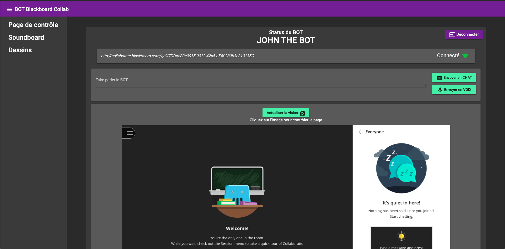
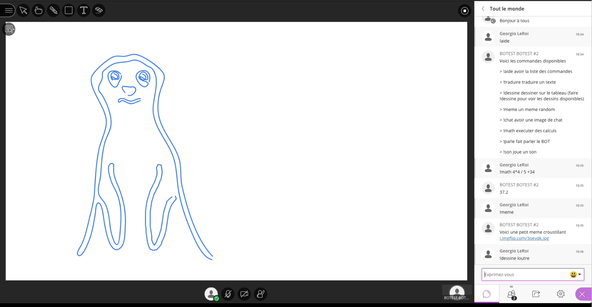
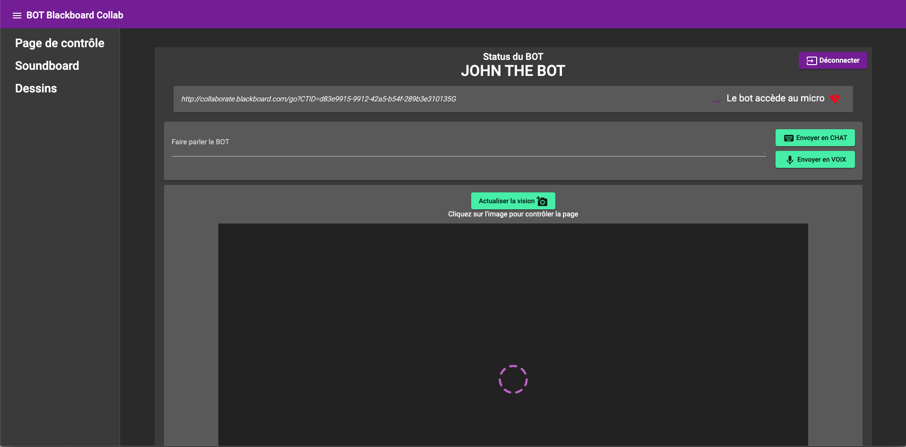
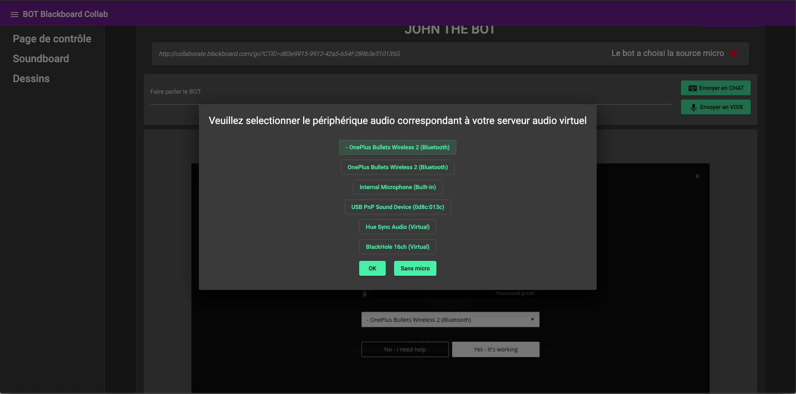
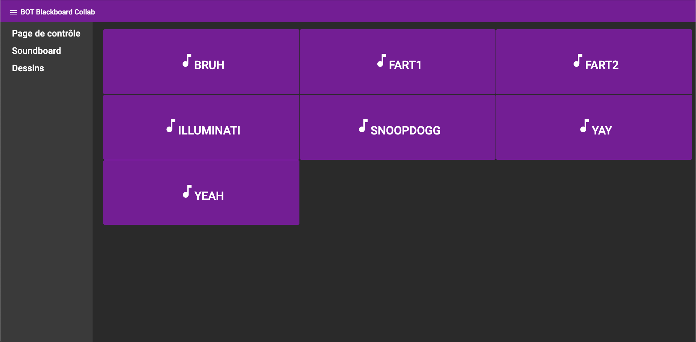
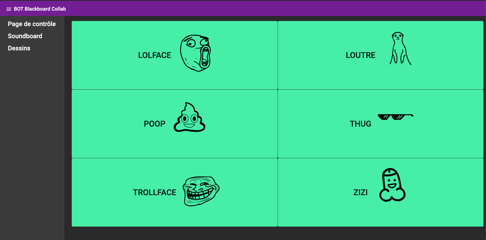
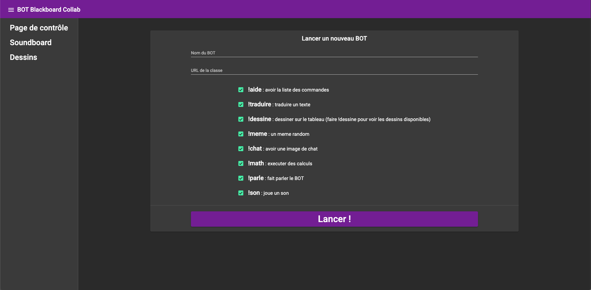
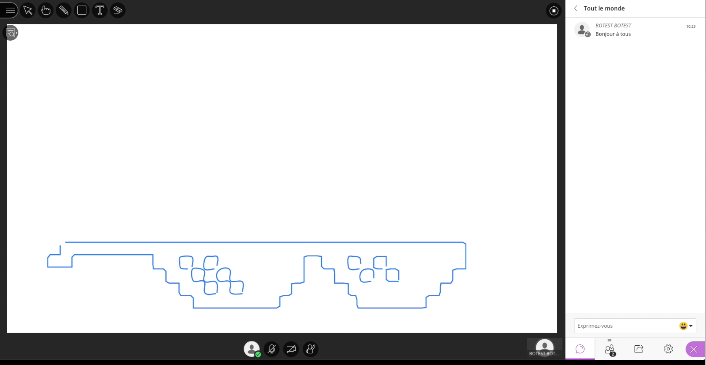
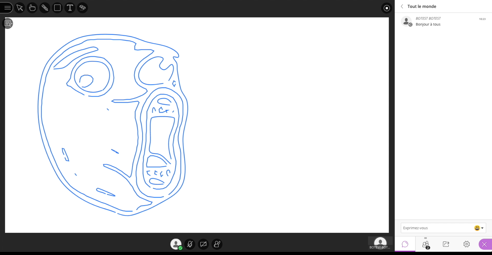

# Blackboard Collaborate BOT (français)

## L'idée

Pendant le confinement, afin d'assurer la continuité pédagogique, mon établissement a décidé d'utiliser [Blackboard Collaborate](https://www.blackboard.com/teaching-learning/collaboration-web-conferencing/blackboard-collaborate) pour des classes virtuelles.
Cet outil propose de nombreuses fonctionnalités comme un chat global, une fonction de dessin sur le tableau affiché par le professeur et la possibilité d'utiliser son micro pour poser des quesitons.

L'idée de ce BOT est de pouvoir controler un utilisateur fantôme, le BOT, qui se connecte à la classe virtuelle et qui peut effectuer différentes commandes en utilisant les outils de l'application.  

J'avais d'abord commencé à développer une première version de ce BOT en Python en utilisant Selenium mais je me suis ensuite rabattu sur NodeJS du fait de sa meilleure comatibilité avec les outils de développement web qui m'étaient utiles pour contrôler un navigateur.  
Ainsi, j'ai décidé d'utiliser [Pupperteer](https://github.com/puppeteer/puppeteer) pour contôler le BOT à l'aide d'un navigateur Chromium sans tête.

<br/>

*La page de Dashboard depuis laquelle vous pouvez envoyer des messages à la classe & un exemple de dessin sur le tableau de la classe :* 
<div style="display: flex; flex-direction: row; align-items: center; text-align: center;">
  
   
</div>


<br/>

# Utilisation

## Pré-requis :

Pour faire fonctionner le projet, vous avez besoin de :
  - NodeJS et npm (instllé avec Node) : [téléchargement](https://nodejs.org/en/)
  - Un serveur audio virtuel :
    - MacOS : [Blackhole](https://github.com/ExistentialAudio/BlackHole)
    - Windows : [VB-Audio Virtual Cable](https://www.vb-audio.com/Cable/index.htm)
    - Linux : [PulseAudio](https://gitlab.freedesktop.org/pulseaudio/pulseaudio)
 
<br/>

# Configurer le serveur audio virtuel :

Pour que le BOT puisse avoir accès au micro pour diffuser les sons proprement en utilisant le microphone de Chromium, vous devez mettre en place un serveur audio virtuel.  
Cet outil servira simplement à rediriger les sons émis sur la sortie audio vers l'entrée audio, correspondant au micro.  
Ainsi quand le BOT jouera un son dans la sortie audio de ce serveur audio virtuel, il sera redirigé vers l'entrée micro et donc, dans l'application Collaborate, le son sera joué comme si le BOT utilisait son micro.  

Voici un *schéma explicatif* :


<br/><br/>
Pour également avoir au son diffusé sur le serveur audio virtuel et le rediriger également vers votre casque audio par exemple, vous pouvez utiliser des périphériques à sortie multiples.
Voici un [exemple](https://support.apple.com/guide/audio-midi-setup/ams7c093f372/mac) sur MacOS.<br/><br/>

<br/>

# *(optionnel)* Configurer sa clé d'API Google Translate :

Pour utiliser la commande ```!traduire``` du BOT, vous devez ajouter vous-même votre clé d'API dans le fichier ```bot/commands/translate.js```   
Plus d'informations : https://github.com/eddiesigner/sketch-translate-me/wiki/Generate-a-Google-API-Key

<br/>

# Lancement du BOT

## **Localement avec NodeJS** :
 
Ouvrez votre terminal, allez dans le dossier **`/bot`**. Effectuez un  **```npm install```** dans le dossier pour installer tous les paquets npm.  

Ensuite faites **`node main.js`** puis ouvrez votre navigateur et allez à l'URL **```http://localhost:3000/main```**  

Vous devriez voir la dashboard.  

*Note* : si vous fermez le process NodeJS, le BOT se ferme également.  

**Notes importante pour MacOS et Windows**

Lors de la première utilisation du BOT, vous pouvez être confrontés à différents petits problèmes réglés dès la deuxième utilisation :  

* Sur **MacOS**, si vous executez le lancement via le terminal, ce dernier pourra vous demander l'accès à la vidéo et à l'audio qui permet ensuite au BOT d'utiliser l'audio dans Chromium.

* Sur **Windows**, lors de la première utilisation avec le terminal également ce dernier peut également vous demander l'accès au contrôle de l'audio. Une fois la permission accordée, relancez le BOT.

* Lorsque le **BOT doit choisir sa configuration audio** : si le BOT reste coincé sur la page de sélection d'un périphérique d'entrée audio lors de la connexion à la classe virtuelle, vous pouvez forcer son passage à la page suivant en cliquant sur le bouton "Skip audio setup" ou "Everything is working well" sur l'iamge de contrôle du BOT de la dashboard.  


<br/>

*Le BOT vous demande de choisir l'entrée audio qu'il va utiliser :* 
<div style="display: flex; flex-direction: row; align-items: center; text-align: center;">
   
    
</div>


<br/>

# Problèmes courants :

- **Le chromedriver est absent** : 
  - Si vous avez des problèmes avec Chromium, allez voir le wiki de [Pupperteer](https://github.com/puppeteer/puppeteer) pour trouver la meilleure façon de configurer votre environnement

- **Les droits d'accès de [Say.js](https://github.com/marak/say.js/)** :
  - Si vous utilisez Powershell sur Windows, vous pouvez rencontrer des probèmes liés aux droits du module Say.js qui permet d'uiliser les voix du systèmes [le problème en question](https://github.com/Marak/say.js/issues/75)

- **Le BOT est bloqué sur la page de configuration audio lors de la connexion** :
  - Si le BOT reste bloqué lors de la séléction d'un périphérique d'entrée audio au cours de sa connexion à la classe, vous devez manuellement le forer à passer à la page suivante en utilisant l'image cliquable de contôle du BOT sur la dashboard et en cliquant sur le bouton "Skip audio setup" ou "Everything is working well".

N'hésitez pas à me faire part de tout autre problème.

<br/><br/>

# Personnalisation :

Pour ajouter des commandes :
* Vous pouvez voir coment sont référencées les commandes dans le dossier ```bot/commands``` et reproduie le pattern pour faire les vôtres.

Ajouter **vos propres fichiers audios** : 
* Vous avez simplement à gliser vos fichiers au format ```.mp3``` dans le dossier ```bot/commands/files/sounds```. Les nouveaux fichiers seront automatiquement référencés au lancement du BOT.

Ajouter **vos propres fichiers fichiers de dessin** : 
* Vous pouvez ajouter n'importe quel fichier de dessin tant qu'ils sont en format ```.svg``` dans le dossier ```bot/files/drawings/svg```. Encore une fois, les nouveaux fichiers seront automatiquement référencés au lancement du BOT.

*Si les fichiers de dessins que vous ajoutez ne fonctionnent pas :* :
* Vous pouvez essayer d'utiliser l'outil [Coordinator](https://spotify.github.io/coordinator/) pour convertir les fichiers ```.svg``` en coordonées. Exportez ensuite les coordonées en ```.json``` et ajoutez parallèlement votre fichier ```.svg``` dans le dossier ```bot/files/drawings/svg``` et votre fichier ```.json``` dans le dossier ```bot/files/drawings/svg```.  


N'hésitez pas à faire des remarques, proposer des idées, etc... ! :)

<br/>

# Screenshots :

*La Soundboard et la page dessins :* 
<div style="display: flex; flex-direction: row; align-items: center; text-align: center;">
  
   
</div>

*La page de lancement et de selection des commandes :* 
<div style="display: flex; flex-direction: row; align-items: center; text-align: center;">
  
</div>

*D'autres exemples de dessins :* 
<div style="display: flex; flex-direction: row; align-items: center; text-align: center;">
  
   
</div>
