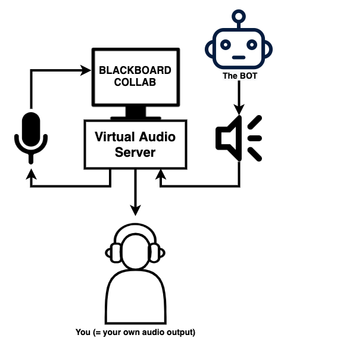

# Blackboard Collaborate BOT

*Voir la [version française](https://github.com/Minifixio/blackboard-collab-bot-js/blob/master/README.fr.md) de la documentation*


## Background

During the lockdown, some schools, such as mine, decided to use [Blackboard Collaborate](https://www.blackboard.com/teaching-learning/collaboration-web-conferencing/blackboard-collaborate) to provide online classes.
The app delivers many options such as chatting, using the mic to speak, drawing on the board, etc... 

The whole idea of this BOT is to let you control a phamtom user over the classroom to play with the different tools of the app.
I first used Python to build a light version of this BOT and quickly switched over NodeJS especially because of the better compatibility with browser control related tools such as [Pupperteer](https://github.com/puppeteer/puppeteer)

<br/>

*The main dashboard page where you can send messages to the class and an example of drawing on the class board :* 


<br/>

# Usage ?

## Requirements :

In order to run it you need :
  - NodeJS and npm (installed with Node) : [download](https://nodejs.org/en/)
  - A virtual audio driver such as :
    - MacOS : [Blackhole](https://github.com/ExistentialAudio/BlackHole)
    - Windows : [VB-Audio Virtual Cable](https://www.vb-audio.com/Cable/index.htm)
    - Linux : [PulseAudio](https://gitlab.freedesktop.org/pulseaudio/pulseaudio)
 
<br/>

# Setup the audio virutal server :

In order to let the BOT use the microphone input in Chromium to play sounds you need to setup a virtual audio server.
Then you need to bind **your sound output directly to your microphone input** such as a loop. 

Here is the *workflow diagram* :



<br/><br/>
To redirect the sound output to both your own user's audio output and mic input, you can use multi-output devices. 
Here is an [example](https://support.apple.com/guide/audio-midi-setup/ams7c093f372/mac) on MacOS<br/><br/>

<br/>

# *(optional)* Setup your Google Translate API Key for the /translate command :

In order to turn on the /translate command, you need to add your own Google Translate API Key in the ```bot/commands/translate.js```  
See https://github.com/eddiesigner/sketch-translate-me/wiki/Generate-a-Google-API-Key for further informations.

<br/>

# Run it !

## **Locally using Node** :
 
Open your terminael, go to the **`/bot`** folder. Run **```npm install```**. It should install all the dependencies the project needs to work.
 
Then run **`node main.js`**, open your browser and go to **```http://localhost:3000/main```**.
 
You should see the dashboard. You can then start the BOT using it.
If the node process dies, the dashboard also quits.

**Important notes for MacOS et Windows**

When you start the BOT for the first time, you may have small bugs which will be fixed at the second use :  

* On **MacOS**, if you start the BOT using the Terminal app, it may asks you the permission to access to the audio and video control. It is just in order to let Chromium play sound via NodeJS. Once you allowed the permission, restart the BOT.

* On **Windows**, in the same way, the Bash app may requires the audio permission. Once again, when you allowed the permission, restart the BOT.

* During the **audio setup** : if the BOT is stuck on the input audio device selection when connecting to the classroom, you can click on the "Skip audio setup" or "Everything is working well" button on the BOT control image in the dashboard.

<br/>

*The BOT let you select the audio input that it will use :* 


<br/>

## Using **Docker** :
 
*Having problems with PulseAudio config, any help is welcomed!*
 
<br/><br/>

# Common issues :

- **Chromedriver missing** : 
  - if you have problems with Chromium see [Pupperteer](https://github.com/puppeteer/puppeteer) wiki to find out how to propely setup your environment.

- **Right access for [Say.js](https://github.com/marak/say.js/)** :
  - If you are launching your app in VSCode for example, the app may require the rights to use your system voices (on MacOS). Make sure to grant them.
  - If you are using Windows, you may have an issue with Powershell. See the [issue](https://github.com/Marak/say.js/issues/75)

- **The BOT stuck on the mic setup page** :
  - Sometimes, even if you setup correctly your audio interface, the BOT struggles to get arround the mic selection page during the initialization  
  What you need to do is to manually click on the *"Mic is working"* button on the setup page to skip this step.

Make sure to report any other issues.

<br/><br/>

# Customizing :

Adding **your own commands** : 
* See how commands are built in the ```bot/commands``` folder


Adding **your own sounds** : 
* To add your own sound effects, you just need to drop your ```.mp3``` file in the ```bot/commands/files/sounds``` folder. The files will be automatically referenced at the launch of the BOT.


Adding **your own drawings** : 
* You can add any custom drawings since they are ```.svg``` files. You just have to drop them in the ```bot/files/drawings/svg``` folder and they will be automatically referenced at the launch of the BOT.

*If you have issues when adding your own drawings :* :
* Try using tools such as [Coordinator](https://spotify.github.io/coordinator/) to convert ```.svg``` files of your own to coordinates and add the ```.svg``` file in the ```bot/files/drawings/svg``` folder and the ```.json``` file from Coordinator in the ```bot/files/drawings/path``` folder


<br/>

If you want to edit the dashboard, you can play with the Angular project inside the ```/dashboard``` folder.  
Then, make sure to run ```ng build --outputPath="../bot/dist"``` to replace the actual dashboard.

<br/>

I'm really open to any suggestions / remarks / contributions :)

<br/>

# Screenshots :

<br/>

*The Soundboard page and Drawings panel :* 


<br/>


*The commands selection & launch page :* 


<br/>

*Some other examples of drawings :* 


<br/>
